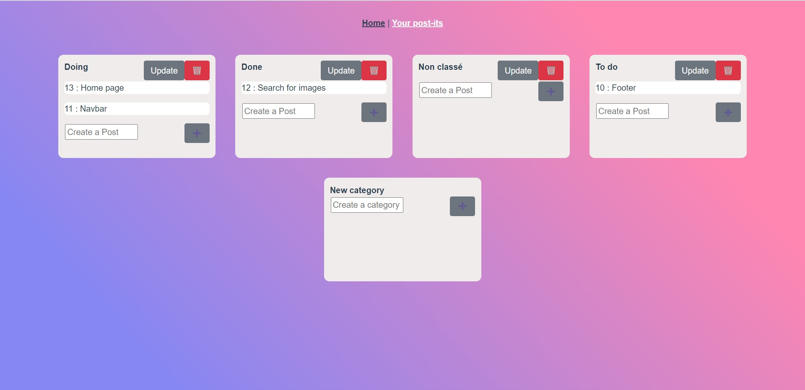
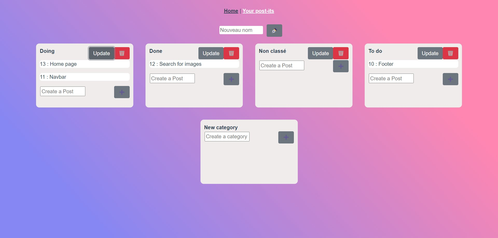
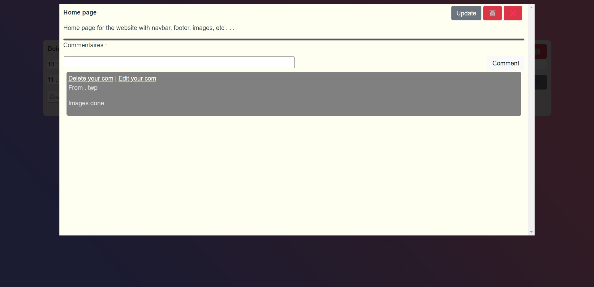
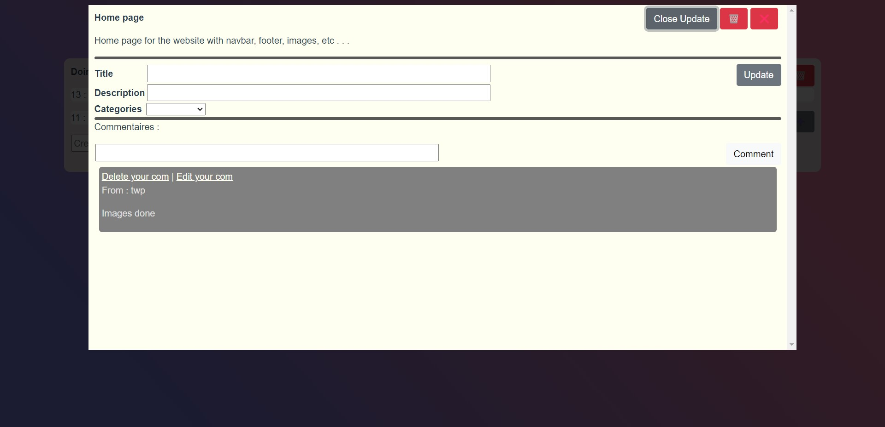

# TWP 

## Project setup
```
npm install
```

### Run the web app
```
npm run serve
```

## Web App Preview

### Home page

Display all the notes created by categories

<p align="center">
  
</p>

### Create a category form

Form for posting a category 

<p align="center">
  
</p>

### Dynamic page

Display the note clicked in bigger with two options :
- Update this note
- Delete this note
- Comment this note

<p align="center">
  
</p>

### Update a note page

Form with actual values in placeholder

<p align="center">
  
</p>

## Authors
- [SULON Adrien](https://github.com/asulon1)
- [FREGONA Tristan](https://github.com/Tfregona)
